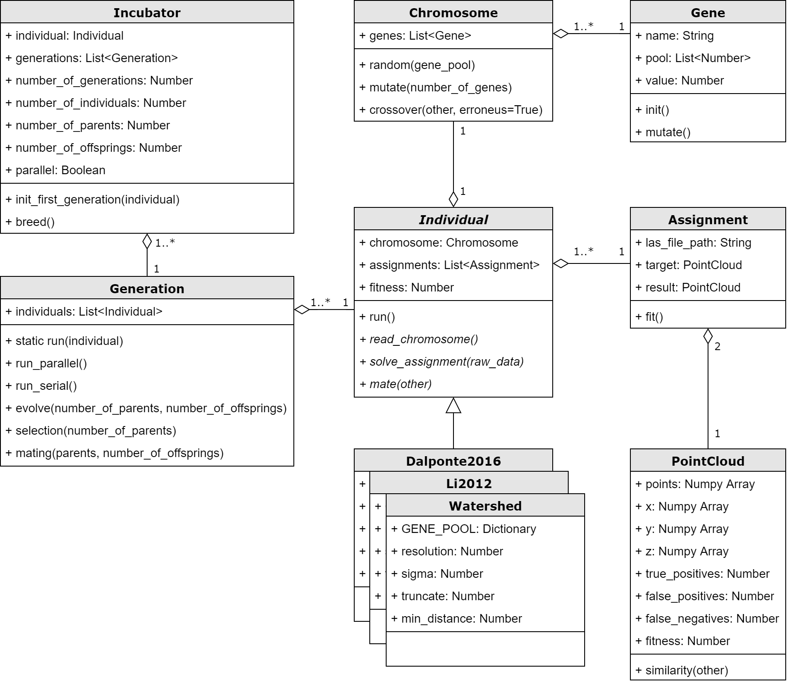

Incubator
==============
Python Command line application (CLI) containing a genetic algorithm to find best parameters for arbitrary assignments.
Realized as a master thesis for the canton of Lucerne to obtain the UNIGIS Master of Science (MSc) degree at the Paris-Lodron University Salzburg

The incubator consists of classes in Python 3.6 and can be used for the evolutionary
development of any algorithm. Starting point is the incubator, which can be started (breed) 
with a concrete instance of an individual (e.g. watershed), an arbitrary number of tasks 
(assignments) and various process parameters. In this case the tasks correspond to the single 
tree extraction in all six test areas. Each algorithm is derived from the base class Individual 
and thus contains the static gene pool (GENE_POOL) and a number of parameters (genes) packed 
into a chromosome (chromosomes). The incubator initializes the first generation of individuals 
and allows all individuals to solve the task either in serial or parallel processing. 
The target as well as the result of a task consists of a point data set (PointCloud), which 
can calculate the accuracy by means of a similarity function. From this metric the 
measurable fitness of an algorithm arises. As in other research on single tree extraction, 
the F1-Score is used to minimize false positive and false negative hits equally. 
The higher the F1-score of a result, the more precisely an algorithm has solved the problem. 
The incubator ensures that the individuals develop within a generation through an evolutionary 
step (evolve) consisting of selection and mating.

Precondition and data
---------------------
The algorithm needs access to the tiled LiDAR point cloud and the tiled DOM and DTM.
(See the settings file `settings/settings.json`) The data should be tiled with **equal raster schema**.

If you want to evolve algorithms based on R code, ensure to install R on your machine.
R code will be run with the library `rpy2` (See: https://rpy2.readthedocs.io/en/latest/)

Installing
----------
The follwing steps describes the installing process in the IT environment of the canton of Lucerne.
1. Setup a new conda environment and install all required packages according the `setup.py` file.
2. Start the Python 3 conda environment with `"C:\Program Files\ArcGIS\Pro\bin\Python\scripts\proenv.bat"`
3. Insert `pip install git+https://app.geo.lu.ch/gitea/GEO/incubator.git` to install the newest release
4. Use credentials for Gitea

Running
-------
1. Configure all parameters in the settings file `settings/settings.json`
2. Configure the path to the conda environment with all installed libraries in `run.bat`
2. Start the evolutionary process by running the script `run.bat`

Uninstalling
------------
If you want to uninstall incubator (e.g. in case of an update), use the following steps:
1. Check or set in ArcGIS Pro the environment to the incubator environment
2. Start the Python 3 conda environment with `"C:\Program Files\ArcGIS\Pro\bin\Python\scripts\proenv.bat"`
3. Insert `pip uninstall incubator` to uninstall the newest release
4. Answer with `y` to complete the uninstall process

Releases
--------
| Date         | Version | Notes                                                    |
|--------------|---------|----------------------------------------------------------|
| 31.03.2020   | 1.0.0   | Initial release                                          |